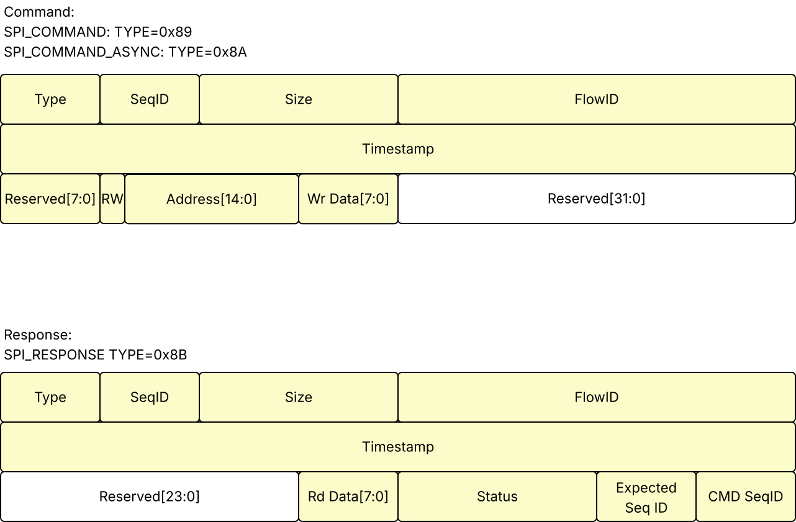
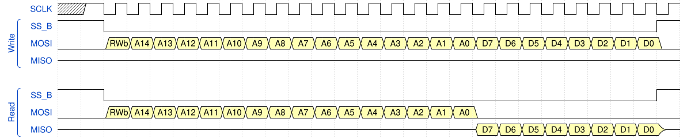

# RTSPI (Real Time SPI interface)

## Introduction

The Real Time SPI interface allows SPI transactions to be synchronized to an externally supplied count of time ticks. The internal data plane uses DRaT protocol packets with dual 64bit physical AXIS interface, one input and one output. Externally it provides the 4 standard SPI interface signals {SCLK, SS#, MOSI, MISO}. There is a 64bit input for the system time count value. All logic runs on a single clock domain, and the SPI clock is a simple data output that is an integer fraction of the logic clock. The control plane registers are all external to the hierarchy and each pass through dedicated bus ports at the top of the hierarchy. Operation assumes a 24bit SPI transaction that is compatable with ADRV9001 family devices.

Ingressing Command packets supply a 15bit address, a read/write flag, and an optional 8bit data value for write operations. Reserved bits provide the capability to expand the address range or drive additionaly slave selects for future expansion. Two DRaT packet types are used to define a synchronous  and asynchronous Command format, differentiated by the presense of a valid 64bit timestamp in the packet. A third DRaT packet type is defined to return the response including results of read operations, containing an 8bit data value, the 8bit SeqID from the related command packet, the 8bit SeqID that was expected for the next Command packet, and a bit map encoding Response status allowing errors to be signalled. A Response packet is always returned for every Command packet, regardless of type.

/* DISCUSS: There are design options here...error/status have been overloaded onto the read packet format. We also made a design choice to adopt a positive acknowledgement, and return a status/read packet for all operations. The currently envisaged errors are a SeqID missmatch in received Command packets, and a late synchronous command packet , but all packets should minimally return a positive ACK on non error state. There is also a policy choice to be made....should Late packets complete or be discarded? (Default is to complete because a late operation should result in a better understood and safer slave state after subsequent SPI transactions complete. */

## Signals

| Name                 | Size   | Direction     | Description                                                  |
| -------------------- | ------ | ------------- | ------------------------------------------------------------ |
| clk                  | 1      | I             | logic clock                                                  |
| rst                  | 1      | I             | logic reset                                                  |
| axis_in              | 64     | axis_t.slave  | command packet bus                                           |
| axis_out             | 64b    | axis_t.master | response packet bus                                          |
| system_time          | [63:0] | I             | System time in ticks                                         |
| spi_t.sclk           | 1      | O             | SPI Clock                                                    |
| spi_t.ss_b           | 1      | O             | Slave Select (active low)                                    |
| spi_t.mosi           | 1      | O             | Master Out Slave In                                          |
| spi_t.miso           | 1      | I             | Master In, Slave out                                         |
| sclk_div             | 8      | I             | CSR that sets integer divde for logic clock to SPI clock     |
| csr_enable           | 1      | I             | CSR. Enable operation when asserted. Dissable and reset when deasserted. (Flush command bus?) |
| ~~csr_flow_id_cmd~~  | ~~32~~ | ~~I~~         | ~~CSR: Sets expect FlowID of ingressing packets (NOTE: NOT IMPLEMENTED)~~ |
| csr_flow_id_response | 32     | I             | CSR: Sets FlowID populated in egressing packets.             |

## Custom DRaT Packet Formats

Two custom DRaT packets are defined for the RTSPI data plane, SPI_COMMAND and SPI_RESPONSE.

## Operation

All signals are driven on the falling edge of SCLK and sampled on the rising edge of SCLK.

SCLK idles in a high state between transactions.

For SPI_COMMAND synchronous operation, the falling (active) edge of SS_B occurs 3 system clk cycles after the timestamp match triggers.

